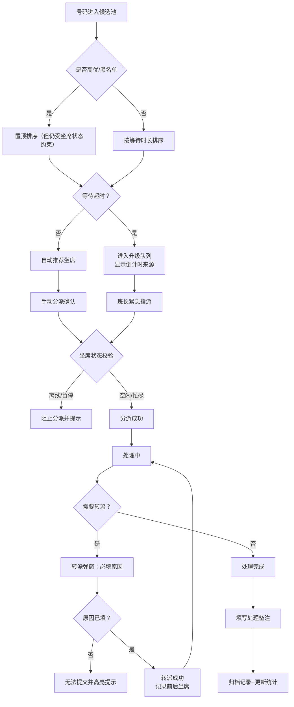

## 1. 产品概述
问询坐席分流屏是一套面向客服调度场景的实时分派管理系统，模拟真实调度台操作，支持排队号码自动推荐、坐席状态管理、转派升级、数据持久化等完整流程。

- **核心目标**：提供可视化的坐席调度工作台，覆盖排队→分派→处理→升级→完成的全链路
- **目标用户**：客服班长（全局调度权限）、普通坐席（个人处理权限）
- **产品价值**：通过自动化推荐 + 可视化调度提升呼叫中心运转效率，确保高优先级号码快速响应

## 2. 核心功能

### 2.1 用户角色
| 角色 | 注册方式 | 核心权限 |
|------|---------|---------|
| 班长 | 角色切换栏 | 全局查看、分派/转派任意号码、修改坐席状态、导出当班记录、查看升级队列 |
| 普通坐席 | 角色切换栏 | 仅查看自己相关号码、处理个人待办、修改自身状态（上线/暂停）、不能操作他人数据 |

### 2.2 功能模块
1. **调度台主页面**：坐席列表、候选排队池、处理中队列、升级队列、当班统计
2. **分派/转派模块**：自动推荐坐席、手动选择坐席、转派原因必填、转派记录留痕
3. **状态管理模块**：坐席上下线/暂停切换、状态联动业务规则（离线/暂停不可接单）
4. **超时升级模块**：倒计时实时显示、超时自动进入升级队列、标注超时来源
5. **本地持久化模块**：队列、坐席、转派记录、倒计时基准全部写入 localStorage
6. **数据导出模块**：一键导出当班记录为 CSV 格式

### 2.3 页面详情
| 页面名称 | 模块名称 | 功能描述 |
|---------|---------|----------|
| 调度台主页面 | 顶部操作栏 | 角色切换（班长/普通坐席）、当班人员选择、导出按钮、刷新数据提示 |
| 调度台主页面 | 当班统计卡片 | 排队中、处理中、已完成、已升级、平均等待时长 5 项关键指标 |
| 调度台主页面 | 坐席列表区 | 坐席卡片展示姓名/技能/状态/当前处理数，支持班长点击切换状态 |
| 调度台主页面 | 候选排队池 | 按优先级排序的待分派号码，展示问题类型/客户等级/等待时长，支持自动推荐和手动分派 |
| 调度台主页面 | 处理中队列 | 展示当前坐席正在处理的号码，支持完成、转派操作 |
| 调度台主页面 | 升级队列 | 展示超时升级号码，显示倒计时来源与剩余时间，支持班长指派 |
| 分派弹窗 | 自动推荐区 | 基于问题类型+技能标签匹配+坐席负载推荐 Top3 坐席并标注匹配度 |
| 分派弹窗 | 手动选择区 | 坐席下拉选择（自动禁用离线/暂停坐席）、处理备注输入 |
| 转派弹窗 | 转派表单 | 新坐席选择（禁用状态校验）、转派原因（必填且有最小字符校验）、转派记录展示 |
| 升级弹窗 | 升级详情 | 显示超时来源、等待时长、历史处理路径、升级后指派坐席 |
| 完成弹窗 | 完成表单 | 处理结果选择、处理备注填写、关联转派/升级记录 |

## 3. 核心流程

### 主要用户流程
1. 班长登录系统 → 查看排队池 → 自动推荐坐席或手动分派 → 坐席开始处理
2. 号码在等待区超时 → 自动进入升级队列 → 显示倒计时来源 → 班长紧急指派
3. 坐席无法处理 → 发起转派 → 填写必填原因 → 新坐席接收 → 系统记录前后坐席
4. 处理完成 → 填写备注 → 号码归档 → 当班统计实时更新
5. 页面刷新 → localStorage 恢复队列、倒计时、转派记录

## 4. 用户界面设计

### 4.1 设计风格
- **主色调**：深空蓝 `#0F172A` 背景 + 科技青 `#06B6D4` 高亮 + 警示橙 `#F59E0B` 超时 + 警戒红 `#EF4444` 升级
- **次色调**：成功绿 `#10B981`（在线/完成）、中性灰 `#64748B`（离线）、淡紫 `#8B5CF6`（高优先级）
- **按钮风格**：圆润 8px、微立体阴影、禁用态 50% 透明度，点击有按压反馈
- **字体排版**：等宽字体展示号码/时长，标题使用半粗体，关键指标数字加大加粗
- **布局风格**：三栏仪表盘布局（左：坐席列表 | 中：双队列 | 右：升级队列+操作记录），卡片式组件，悬浮微动画
- **图标风格**：Lucide 线性图标，状态图标带脉冲动画（忙碌/超时状态）
- **视觉特效**：渐变描边、玻璃拟态弹窗、队列滚动吸附、倒计时呼吸效果

### 4.2 页面设计概览
| 页面名称 | 模块名称 | UI 元素 |
|---------|---------|---------|
| 调度台主页面 | 顶部操作栏 | 毛玻璃背景、角色切换胶囊按钮、渐变分隔线、状态徽章 |
| 调度台主页面 | 当班统计 | 数字跳动动画、趋势箭头、5 色渐变背景、hover 放大效果 |
| 调度台主页面 | 坐席列表 | 头像+技能标签徽章、状态 LED 灯（发光）、进度条表示负载、卡片 3D 悬浮效果 |
| 调度台主页面 | 候选排队池 | 优先级色块、客户等级星级、等待时长闪烁（超时前30s呼吸效果）、高优先级置顶标识 |
| 调度台主页面 | 处理中队列 | 处理进度条、剩余预估时间、转派按钮、完成按钮 |
| 调度台主页面 | 升级队列 | 倒计时来源标签、超时闪烁边框、升级原因、紧急指派按钮 |
| 分派弹窗 | 分派弹窗 | 玻璃拟态弹窗、推荐坐席高亮（匹配度百分比）、离线坐席灰显禁用、提交前校验 |
| 转派弹窗 | 转派弹窗 | 前后坐席对比、转派原因必填（红框校验）、转派历史记录时间线 |
| 完成弹窗 | 完成弹窗 | 处理结果下拉、处理备注富文本、关联转派/升级记录摘要 |
| 升级弹窗 | 升级弹窗 | 超时来源时间戳、等待总时长、历史处理路径时间线、班长紧急指派 |

### 4.3 响应式设计
- **桌面端（主）**：1920×1080 及以上，三栏完整布局，所有队列同时展示
- **平板端（次）**：1280-1919，两栏布局（坐席列表+队列合并、升级队列折叠面板）
- **移动端**：<1280，单栏垂直滚动，队列Tab切换，坐席列表折叠

## 5. 业务规则与约束

### 5.1 坐席状态规则
| 状态 | 标识色 | 可否接单 | 权限说明 |
|------|--------|---------|----------|
| 空闲 | `#10B981` 绿色脉冲 | 是 | 可被自动推荐和手动分派 |
| 忙碌 | `#F59E0B` 橙色常亮 | 是（可接受） | 负载达上限时不参与自动推荐 |
| 暂停 | `#8B5CF6` 紫色闪烁 | **否** | 班长可强制恢复，普通坐席可自行暂停 |
| 离线 | `#64748B` 灰色熄灭 | **否** | 任何分派操作被阻止并弹出提示 |

### 5.2 排队号码排序规则
1. **高优先级（VIP/黑名单）**：置顶，但不绕过坐席状态限制（离线/暂停仍不可接）
2. **客户等级**：5星 > 4星 > 3星 > 2星 > 1星
3. **等待时长**：长 > 短
4. **超时预警**：剩余30s进入呼吸闪烁，倒计时归零自动升级

### 5.3 角色权限矩阵
| 操作 | 班长 | 普通坐席 |
|------|------|---------|
| 切换自身状态 | ✅ | ✅（仅上下线/暂停） |
| 修改他人状态 | ✅ | ❌ |
| 手动分派号码 | ✅ | ❌ |
| 转派任意号码 | ✅ | ❌（仅可转派自己处理中的） |
| 处理完成号码 | ✅ | ✅（仅自己的） |
| 升级队列指派 | ✅ | ❌ |
| 导出当班记录 | ✅ | ❌ |
| 查看全部队列 | ✅ | ✅（只读非本人号码） |

### 5.4 转派规则
- 必须填写转派原因（最小5字符），未填写提交按钮禁用并高亮输入框
- 转派记录必须保留：原坐席 → 新坐席、转派时间、转派原因、操作人
- 转派后号码重新进入处理中队列，等待时长累计不重置
- 不可转派给离线/暂停坐席（下拉禁用）

### 5.5 超时升级规则
- 超时时长阈值：默认5分钟（可在配置中调整）
- 超时后号码自动从候选池移入升级队列
- 升级队列显示倒计时来源：`候选池等待: X分Y秒`
- 仅班长可从升级队列指派坐席
- 升级记录保留：升级时间、原等待时长、升级后坐席

### 5.6 本地持久化范围
- ✅ 坐席列表及状态
- ✅ 候选排队池号码及进入时间戳
- ✅ 处理中队列号码及分派时间戳
- ✅ 升级队列号码、升级时间戳、超时来源时间戳
- ✅ 转派记录完整时间线
- ✅ 处理完成记录
- ✅ 当前角色选择
- ✅ 当前选中坐席（班长视角）
- ❌ 实时倒计时显示（刷新后基于时间戳重新计算）

## 6. 数据字典

### 6.1 问题类型
| 编码 | 名称 | 关联技能标签 |
|------|------|-------------|
| CONSULT | 业务咨询 | 业务知识、产品知识 |
| COMPLAINT | 投诉处理 | 沟通技巧、投诉处理 |
| TECH | 技术支持 | 技术知识、故障排查 |
| BILL | 账单查询 | 财务知识、账单系统 |
| OTHER | 其他 | 通用服务 |

### 6.2 技能标签
- 业务知识、产品知识、沟通技巧、投诉处理、技术知识、故障排查、财务知识、账单系统、通用服务、英语能力

### 6.3 客户等级
| 星级 | 等级名称 | 排序权重 |
|------|---------|---------|
| 5 | 钻石VIP | 100 |
| 4 | 金牌 | 80 |
| 3 | 银牌 | 60 |
| 2 | 普通 | 40 |
| 1 | 新客户 | 20 |

### 6.4 转派原因预设
- 技能不匹配、客户指定坐席、坐席即将下班、需上级介入、跨部门协作、系统操作需求

## 7. 验收路径

### 7.1 基础场景验收
1. **转派号码但不填原因无法提交**
   - 步骤：选择处理中号码 → 点击转派 → 选择新坐席 → 留空转派原因 → 点击提交
   - 预期：提交按钮禁用/点击后红框提示原因必填

2. **尝试分派给离线坐席被阻止**
   - 步骤：候选池选号码 → 分派弹窗 → 选择离线坐席 → 提交
   - 预期：离线坐席在下拉中灰显禁用/选中后提示"该坐席当前离线，无法接单"

3. **刷新后已升级号码仍在升级队列**
   - 步骤：等待号码超时升级 → 确认升级队列显示 → 按F5刷新页面
   - 预期：升级队列号码保留，倒计时来源显示正确，时间基于时间戳重算

### 7.2 扩展场景验收
4. 普通坐席尝试修改他人状态被拒绝
5. 高优先级号码置顶但无法分派给离线坐席
6. 超时号码显示倒计时来源且仅班长可指派
7. 当班记录导出CSV格式正确包含转派和升级记录
8. 角色切换后权限对应变化（分派/转派按钮显隐）