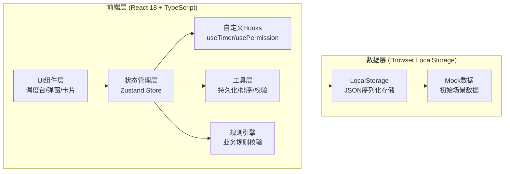
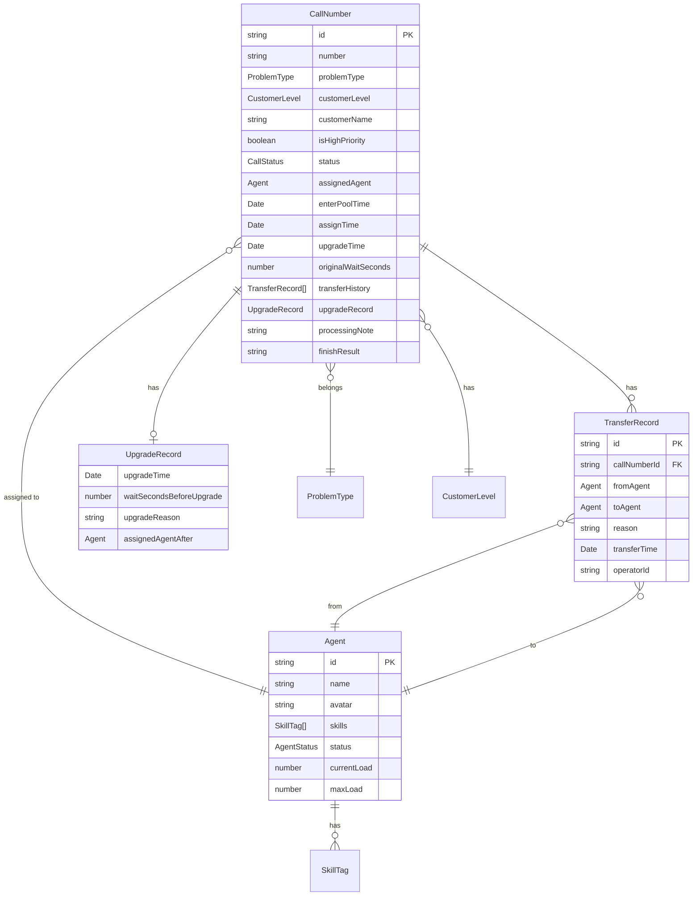

## 1. 架构设计



## 2. 技术描述

- **前端框架**: React 18 + TypeScript
- **构建工具**: Vite 5
- **CSS方案**: TailwindCSS 3 + CSS变量主题系统
- **状态管理**: Zustand 4（内置中间件实现localStorage持久化）
- **图标库**: Lucide React
- **路由**: 单页应用，无路由（react-router-dom仅预留不启用）
- **后端服务**: 无（纯前端模拟）
- **数据存储**: localStorage（JSON序列化，时间戳驱动倒计时）
- **容器化**: Nginx Alpine 提供静态资源服务

## 3. 目录结构定义

| 路径 | 用途 |
|------|------|
| `src/types/` | TypeScript类型定义（数据模型、枚举） |
| `src/store/` | Zustand状态管理（含persist中间件） |
| `src/utils/` | 工具函数（排序、校验、导出、时间格式化） |
| `src/rules/` | 业务规则引擎（权限、状态拦截、排序） |
| `src/hooks/` | 自定义Hooks（useTimer、usePermission） |
| `src/components/` | UI组件（按功能分子目录） |
| `src/components/layout/` | 布局组件（顶部栏、三栏容器） |
| `src/components/dashboard/` | 调度台组件（统计卡片、队列面板） |
| `src/components/agents/` | 坐席相关组件（坐席卡片、状态徽章） |
| `src/components/queues/` | 队列组件（候选池、处理中、升级队列项） |
| `src/components/modals/` | 弹窗组件（分派、转派、完成、升级详情） |
| `src/data/` | Mock初始数据 |
| `src/config/` | 常量配置（超时时长、状态颜色、技能映射） |
| `src/styles/` | 全局CSS（Tailwind指令、自定义动画） |

## 4. 数据模型

### 4.1 类型定义图



### 4.2 枚举定义

```typescript
enum AgentStatus {
  IDLE = 'idle',       // 空闲
  BUSY = 'busy',       // 忙碌
  PAUSED = 'paused',   // 暂停
  OFFLINE = 'offline', // 离线
}

enum CallStatus {
  POOL = 'pool',           // 候选池
  PROCESSING = 'processing', // 处理中
  UPGRADED = 'upgraded',   // 已升级
  FINISHED = 'finished',   // 已完成
}

enum ProblemType {
  CONSULT = 'CONSULT',     // 业务咨询
  COMPLAINT = 'COMPLAINT', // 投诉处理
  TECH = 'TECH',           // 技术支持
  BILL = 'BILL',           // 账单查询
  OTHER = 'OTHER',         // 其他
}

enum CustomerLevel {
  NEW = 1,       // 新客户
  NORMAL = 2,    // 普通
  SILVER = 3,    // 银牌
  GOLD = 4,      // 金牌
  DIAMOND = 5,   // 钻石VIP
}

enum UserRole {
  MONITOR = 'monitor',   // 班长
  AGENT = 'agent',       // 普通坐席
}
```

## 5. Zustand Store 设计

```typescript
interface AppState {
  // 配置
  currentRole: UserRole;
  currentAgentId: string | null;  // 普通坐席视角下的本人id
  upgradeThresholdSeconds: number; // 超时升级阈值

  // 数据主体
  agents: Agent[];
  poolQueue: CallNumber[];      // 候选池
  processingQueue: CallNumber[]; // 处理中
  upgradeQueue: CallNumber[];   // 升级队列
  finishedRecords: CallNumber[]; // 已完成

  // 视图状态
  activeModal: ModalState | null;
  toastMessage: ToastMessage | null;
}

interface ModalState {
  type: 'assign' | 'transfer' | 'finish' | 'upgradeDetail';
  callNumberId: string;
}
```

**persist 白名单**（localStorage 持久化）：
- currentRole, currentAgentId, upgradeThresholdSeconds
- agents（含status）
- poolQueue（enterPoolTime时间戳）
- processingQueue（assignTime时间戳）
- upgradeQueue（upgradeTime、originalWaitSeconds）
- finishedRecords
- （注意：toastMessage/activeModal不持久化）

## 6. 业务规则引擎模块

### 6.1 规则分类
| 规则模块 | 触发时机 | 校验内容 |
|---------|---------|---------|
| 状态校验规则 | 分派/转派前 | 坐席状态是否允许接单（OFFLINE/PAUSED拦截） |
| 权限校验规则 | 所有操作前 | 角色权限矩阵匹配判断 |
| 表单校验规则 | 弹窗提交 | 转派原因长度≥5、必填项非空 |
| 排序规则 | 队列渲染前 | 高优先级置顶→星级→等待时长 |
| 升级检测规则 | 计时器tick | 比较当前时间与enterPoolTime+阈值 |
| 自动推荐规则 | 分派弹窗打开 | 技能匹配度+负载+状态综合打分 |

### 6.2 自动推荐算法（Top 3）
```
匹配度Score = 技能交集数 × 30
            + (MAX_LOAD - 当前负载) × 10
            + 状态奖励(IDLE=20, BUSY=5, PAUSED/OFFLINE=-∞)
排序取Top 3
```

## 7. 本地持久化实现方案

### 7.1 存储Key
`key: 'call_center_dispatch_v1'`

### 7.2 时间戳驱动倒计时
- 不存"剩余X秒"，存绝对时间戳（enterPoolTime、assignTime、upgradeTime）
- 组件挂载时基于`Date.now()`重新计算所有倒计时
- `useTimer` Hook 每秒forceUpdate刷新展示
- 刷新后倒计时无缝衔接（没有跳变）

### 7.3 序列化/反序列化
- Date对象 → ISO字符串存 → new Date()读
- 枚举存字面量字符串 → 读时类型断言
- Zustand `persist` 中间件配置：
```typescript
persist({
  name: 'call_center_dispatch_v1',
  partialize: (state) => pick(state, PERSIST_KEYS),
})
```

## 8. 视觉设计系统

### 8.1 颜色变量 (CSS Variables)
```css
:root {
  --bg-primary: #0F172A;    /* 深空蓝主背景 */
  --bg-panel: #1E293B;      /* 面板背景 */
  --bg-card: #334155;       /* 卡片背景 */
  --accent-cyan: #06B6D4;   /* 科技青高亮 */
  --accent-orange: #F59E0B; /* 警示橙超时 */
  --accent-red: #EF4444;    /* 警戒红升级 */
  --accent-green: #10B981;  /* 成功绿 */
  --accent-purple: #8B5CF6; /* 淡紫高优 */
  --text-primary: #F1F5F9;  /* 主文字 */
  --text-secondary: #94A3B8;/* 次文字 */
  --border-glass: rgba(6, 182, 212, 0.2); /* 玻璃边框 */
}
```

### 8.2 关键动画
| 名称 | 用途 | 实现 |
|------|------|------|
| pulse-glow-green | 空闲坐席LED | box-shadow 绿色脉冲 |
| pulse-glow-orange | 忙碌LED/超时预警 | box-shadow 橙色脉冲 |
| breath-warn | 超时前30s号码 | opacity 0.6↔1 循环 |
| border-flash-red | 升级队列卡片边框 | border-color 闪烁 |
| count-float | 统计数字变化 | transform translateY过渡 |

## 9. Mock数据场景覆盖

### 9.1 坐席覆盖（8人）
| 姓名 | 状态 | 技能 | 负载 | 场景用途 |
|------|------|------|------|---------|
| 张伟 | IDLE | 业务知识、投诉处理 | 0/3 | 空闲可接 |
| 李娜 | BUSY | 技术知识、故障排查 | 2/3 | 忙碌可接 |
| 王磊 | PAUSED | 财务知识、账单系统 | 1/3 | 暂停不可接 |
| 刘洋 | OFFLINE | 英语能力、通用服务 | 0/3 | 离线不可接 |
| 陈静 | IDLE | 产品知识、沟通技巧 | 0/3 | 空闲推荐 |
| 赵强 | BUSY | 投诉处理、沟通技巧 | 3/3 | 满负载不推荐 |
| 孙丽 | IDLE | 财务知识、通用服务 | 1/3 | 空闲对比 |
| 周杰 | IDLE | 技术知识、英语能力 | 0/3 | 技能匹配测试 |

### 9.2 号码覆盖（12个）
- **候选池（6）**：高优钻石VIP×1、金牌×1、银牌×2、普通×1、新客户×1（其中1个剩余10s超时，用于触发升级测试）
- **处理中（3）**：不同坐席处理中，含一个可转派测试
- **升级队列（1）**：已超时升级，验证刷新保留
- **已完成（2）**：含转派记录和升级记录各一

## 10. 导出功能方案

### 10.1 CSV格式
- 表头：号码、客户名、问题类型、客户等级、状态、分派坐席、进入池时间、分派时间、完成时间、转派次数、是否升级、处理备注、处理结果
- 编码：UTF-8 BOM（Excel中文兼容）
- 触发：班长点击导出按钮 → Blob下载

## 11. 验收测试脚本

### 11.1 手动验证脚本（`tests/manual-checklist.md`）
对应PRD§7的3个基础+5个扩展验收路径，逐项给出操作步骤和预期截图点

### 11.2 自动化检查（`tests/smoke-test.sh`）
- Node脚本读取package.json校验依赖完整性
- TypeScript编译检查`tsc --noEmit`
- 检查构建产物存在性
- 正则校验关键规则：转派原因≥5字符校验、离线状态拦截逻辑、localStorage持久化key存在
